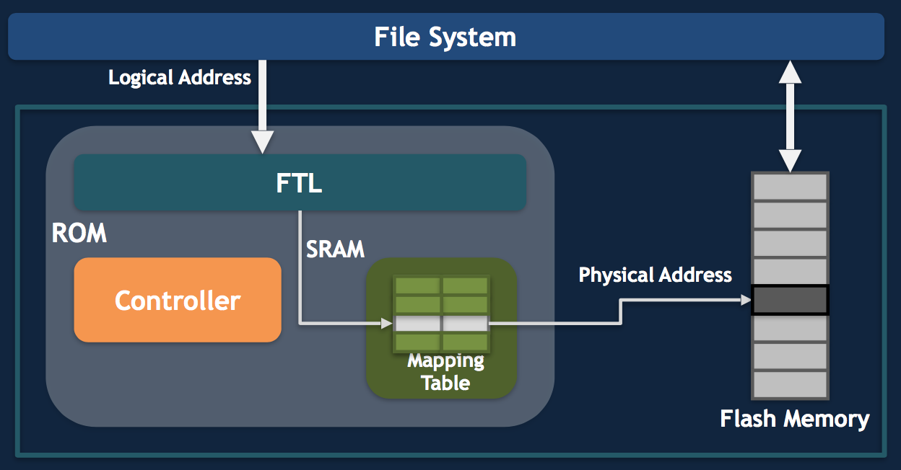

# UI
Compared to LCD screens, OLED screens have advantages in color, bendability, thickness and power consumption. Because of these advantages, full screens, curved screens and future flexible folding screens all use OLED materials.  
px->dpi  

Rendering:  
Similar to the painting process.  
Pen: Skia/OpenGL  
Paper: Surface  
Board: Graphic buffer, Triple buffering.  
Display: SurfaceFlinger.  

## Project Butter (Android 4.1)  
VSYNC+Triple Buffering  

Triple Buffering:  
CPU buffer + GPU buffer + Display(3nd Graphic Buffer)  
=> Frame Buffer  

Traceview + systrace + Tracer for OpenGL ES  

## RenderThread (Android 5.0)  
RenderNode + RenderThread  

## gfxinfo + hwui + Vulkun (Newer Android)  
gfxinfo is a command used with adb shell (Android Debug Bridge) to gather information about the graphics performance of an application.  
This command is particularly useful for developers to analyze and optimize the rendering performance of their apps. When you run adb shell dumpsys gfxinfo pkg_name,  
it provides detailed output about the rendering time for each frame, helping to identify bottlenecks or inefficiencies.  

HWUI stands for Hardware Accelerated User Interface, which refers to the hardware acceleration support built into Android's drawing framework.  

Vulkan is a modern cross-platform graphics and compute API, developed by the Khronos Group.  
It is known for providing high-efficiency, low-overhead access to modern GPUs used in a wide variety of devices from PCs and consoles to mobile devices and embedded platforms.  
Vulkan gives developers more control over GPU operations and is designed to enable better performance and more balanced CPU/GPU usage.

## Rendering
60fps: 1000 ms／60 fps = 16 ms (rendering time, including UI thread + Render thread + Graphics).  
Test tools: Profile GPU Rendering + Show GPU Overdraw  
Debugger: systrace + Tracer for OpenGL ES + Graphics API Debugger (GAPID)  

```bash
adb shell dumpsys gfxinfo pkgname  
adb shell dumpsys gfxinfo pkgname framestats  
adb shell dumpsys SurfaceFlinger  
```

### Optimization
HW offload:  
    SVG->Bitmap  
Create View:  
    1. Code/X2C  
    2. Async: Looper Msg Q -> UI Looper MsgQueue   
    3. View reuse  

# Native Hooks  
Hooks are modified at runtime, mainly find the library, and find the addr, then replace it.  
1. GOT/PLT Hook  
PLT (Procedure Linkage Table): In code section, external func will have a record in PLT.  
GOT (Global Offset Table): Stores func offset, after relocate, will have absolute func addr.  
Facebook has open-sourced it's plt hook, and iqiyi open-sourced it's got hook.  

2. Trap hook  
Ptrace, When the debugger is bound to the target program, any signal of the target program will be intercepted by the debugger first, and the debugger will have the opportunity to process the relevant signal, and then hand over the execution permission to the target program to continue execution. Facebook's Profilo is using SIGPROF signal to trace latency.  

```bash
readelf -d /usr/lib/libmultipath.so | grep NEEDED  
 0x0000000000000001 (NEEDED)             Shared library: [libdevmapper.so.1.02.1]  
 0x0000000000000001 (NEEDED)             Shared library: [libudev.so.1]  
 0x0000000000000001 (NEEDED)             Shared library: [libmpathcmd.so.0]  
 0x0000000000000001 (NEEDED)             Shared library: [liburcu.so.8]  
 0x0000000000000001 (NEEDED)             Shared library: [libaio.so.1]  
 0x0000000000000001 (NEEDED)             Shared library: [libsystemd.so.0]  
 0x0000000000000001 (NEEDED)             Shared library: [libc.so.6]  
```

3. Inline hook  
Inline hook will update func beginning prologue with jump instruction, and jump to target hook func, and retain original function, and complete subsequent.
ByteDance has open-sourced its android inline hook.
It is not restricted by GOT/PLT table, so can hook any func in theory. But implementation is complicated, so not widely used.  

# Framework  
Components: Activity, Service, Broadcast, Contprovider.
Handler:
Binder:
Rendering:
Sharepreference:
View/ViewGroup:
Touch:
Services: AMS, PMS, WMS, 

# Crash issue  
Java crash, Native crash.  
Usually caused by Process.killProcess(),exit(), crash (i.e. invalid mem access), low memory killer, ANR.  
Check:  
Crash info, Logcat (check Error Warning logs), mem info (OOM, virtual mem use up, can check via /proc/meminfo and /proc/pid/smap, for VSS, RSS, PSS, USS).  
fd num (check /proc/pid/limits), thread count (need < 400, if each use 2MB, then it is 8GB), JNI (DumpReferenceTables).  
ANR (check iowait, CPU, GC, system server).  

# Mem issue
Check GC info:  
```bash
adb shell kill -S QUIT PID  
adb pull /data/anr/traces.txt  
```
low mem killer:  
Home -> Service -> Perceptible -> Foreground -> Persistent -> System -> Native.  
Check mem:  
```bash
adb shell dumpsys meminfo <package_name|pid> [-d]  
adb shell setprop wrap.<APP> '"LIBC_DEBUG_MALLOC_OPTIONS=backtrace logwrapper"'  
adb shell setprop wrap.<APP> '"LIBC_HOOKS_ENABLE=1"'  
```
## Optimization
Check device-year-class, and do optimization accordingly.  
LeakCanary to check Java mem leak.  
Probe to check OOM.  
Malloc hook to debug Native mem leak.  
PLT hook to check library mem alloc func.  
gcc's -finstrument-functions and ld's –wrap to check mem alloc/ free funcs.  
Mem monitor: check one user's usage, i.e. every 5 minutes, collect PSS, Java heap info, pic total mem.  
GC info:
```bash
Debug.getRuntimeStat("art.gc.gc-count");  
Debug.getRuntimeStat("art.gc.gc-time");  
Debug.getRuntimeStat("art.gc.blocking-gc-count");  
Debug.getRuntimeStat("art.gc.blocking-gc-time");  
```

# Latency issue  
```bash
top, strace, vmstat, /proc/pid/stat, /proc/pid/schedstat, uptime (restrict to 0.7 * cores)  
```
Tools:  
Traceview, Nanoscope, systrace, Simpleperf, Android studio profiler. With Call chart and Flame chart.  
Monitor:  
Msg queue, stub, profilo.  
## Analysis  
Java thread state: WAITING, TIME_WAITING, BLOCKED.  
Native thread state: Suspended.  
Get stack traces: Thread.getAllStackTraces().  

# Startup optimization  
Startup steps:  
    T1: Preview.  
    T2: Splash screen.
    T3: Home page show.  
    T4: Operationable.  
Tools: Traceview (Cost too much, result is not so real), Nanoscope (More accurate), Simpleperf, systrace (Check GC, systerm server, CPU scheduling).  
Ways:  
```bash
python systrace.py --list-categories  
python systrace.py dalvik -b 90000 -a com.sample.gc  
```
Reduce hooks, thread optimization (reduce num, check sched switches, check lock).  
If sth. only used by some of the users, don't preload, optimize focus on most of the users.  
In startup phase, suggest avoid network I/O, and optimize disk I/O.  

Plugin, and hot fix.  
Monitoring:  
lab monitor, online monitor (Android Vitals), 
Fast open slow open ratio. For example, with a 2-second fast opening ratio and a 5-second slow opening ratio, we can see what percentage of users have a very good user experience.  
90% of the user's startup time. If 90% of the users take less than 5 seconds to start, then we take 5 seconds to start in the 90% zone.  
KPI: Throughput and IOPS.  

# IO optimization
Hardware -> Linux kernel -> Android Framework -> API.  
F2FS (Flash-Friendly File System), small file is better.  
/proc/filesystems can see all file systems.  
Page cache: file system cache for data, improve hit ratio.  
Buffer cache: disk cache for data, can combine IO requests, reduce IO rate.  
Those caches can be used in both read and write scenarios.  
Performance: SSD < eMMC < UFS < NVMe.  

IO latency:  
1. Mem not enough, system will recycle page cache and buffer cache.  
2. Write amplification. Write operation of a page will cause the migration of the entire block data.  
We can use fstrim/ TRIM mechanism to optimize it.
Monitor Ways:  
1. proc fs
```bash
/proc/pid/schedstat  
echo 1 > /proc/sys/vm/block_dump
dmesg -c grep pid
```
2. strace  
```bash
# -tt means timestamp and us, -T means syscall time, -f means trace forked child processes, -c means summary only, instead of print each line.  
strace -ttT -f -p [pid]
strace -c -f -p [pid]
```
3. vmstat  
```bash
echo 3 > /proc/sys/vm/drop_caches  
vmstat 1  
dd if=/dev/zero of=/data/data/test bs=4k count=1000  
```

Type of IOs:  
standard IO (might lost data), mmap (performance good, virt mem increase), direct IO (bypass cache, slow but won't lost data).  
```bash
vm.dirty_writeback_centisecs = 500   
vm.dirty_expire_centisecs = 3000   
vm.dirty_background_ratio = 10  
vm.dirty_ratio = 20  
```
Sync APIs: sync/ fsync/ msync.  
Share mem (0 copy): need protect race conditions.  
Binder (1 copy): copy_from_user() from user to kernel, and mmap from kernel to user.  
Socket (2 copy).  

iowait is high, means IO has some pb. iowait is low, might also has some pb.  
NIO: async IO. Google GFS, Taobao TFS, Facebook Haystack.  
## Trace  
Java hook: perf not good, can't trace native code, Android version compatibility.  
Native hook: Profilo is PLT hook, perf is better than GOT hook. GOT hook compatibility is better.  
        facebook atrace.cpp can traverse all libs, and trace.    
Trace APIs: open(), read(), write(), close().  
Handle unit: filesystem is per block, disk is per page.  
```bash
echo 3 > /proc/sys/vm/drop_caches  
time dd if=/tmp/iotest of=/dev/null bs=4096  
# read ahead can improve perf, usually it is 128KB, so better have bigger read block.  
/sys/block/[disk]/queue/read_ahead_kb  
/proc/sys/vm/block_dump  
/proc/diskstats  
```
## Optimize ways  
1. Use mmap or NIO for big file.  
2. The installation package is not compressed. For the files required for the startup process, we can specify that the installation package is not compressed.  
3. Buffer reuse. We can use Okio library for ByteString and Buffer reuse.  
4. Algorithm or data structure to use less IO operations. Reduce usage of XML, JSON, which has much info.  

# Storage optimization  
Check storage info:  
```bash
/proc/partitions  
df  
# OS reserved  
/system  
# User data  
/data  
# System partition or recovery   
/cache  
# Vendor changes for Android, with Treble project, vendor can update this partition only.  
/vendor  
# External or internal sdcard  
/storage  
```
Storage options: SharedPerferences (MMKV), ContentProvider (Suitable for big data transfer), file, database.  
Serializable, Parcelable, Serial (Fastest).  
Data: JSON, Protocol Buffers (Fastest).  
Storage monitor: perf monitor, ROM monitor.  
Serialize: WriteReplace, writeObject.  
Deserialize: readObject, readResolve.  

Database:  
SQLite  
Optimize parameters:  
```bash
PRAGMA locking_mode = EXCLUSIVE  
PRAGMA SQLITE_THREADSAFE = 2  
# Write-Ahead Logging  
PRAGMA schema.journal_mode = WAL  
```
Index optimization:  
Build right index, choose single/ multi/ compound indexes, primary key use int instead of string.  
Each table is a B-tree.  
Use 4KB as pagesize, instead of 1024B.  
Latency can use SQLiteTrace.  

There are also other DBs like Realm and LevelDB.  

# Power consumption optimization  
Use AI to optimize resource usages.  
Config: /frameworks/base/core/res/res/xml/power_profile.xml.  
https://android.googlesource.com/platform/frameworks/base/+/master/core/res/res/xml/power_profile.xml  
```bash
# Estimate for each module.  
adb shell dumpsys batterystats > battery.txt  
adb shell dumpsys batterystats --reset  
adb bugreport bugreport.zip  
```
Background power usage: WakeLock, WiFi, Bluetooth.  
Battery Historian to analyze the usage.  
Mostly caused by msg push scenario, or some logic forgot to turn off GPS, WiFi, or WakeLock.  
Monitor: Android Vitalsm or hooks.  
Facebook has Battery Metrics open source library to monitor the usage.  

# Package size optimization  
When size is small, download conversion rate is high.  
Remove unnecessary features, or use H5 instead.  
  
ProGurad:  
```bash
-printconfiguration  configuration.txt  
-keep public class * extends android.app.Activity  
-keep public class * extends android.app.Application  
-keep public class * extends android.app.Service  
-keep public class * extends android.content.BroadcastReceiver  
-keep public class * extends android.content.ContentProvider  
-keep public class * extends android.view.View  
```
R8: Can reduce 3% Dex size.  
There are debug and release pkg, differences are in DebugItem (debug info + instruction line/ file line num).  
```bash
-keepattributes SourceFile, LineNumberTable  
```
Dex:  
Redex library is good, use xz or 7z to zip it.  
Can use facebook's oatmeal to generate odex file.  
Native library:  
Also can use xz or 7z to zip it.  
ProGuard Shrinking, delete useless code.  
Strip debuginfo.  
## Tools
AndResGuard.  
The resource obfuscation tool can reduce the size of resources.arsc, signature files, and ZIP files by simply optimizing the short path.  
```c
/* these formats are already compressed, or don't compress well */
static const char* kNoCompressExt[] = {
    ".jpg", ".jpeg", ".png", ".gif",
    ".wav", ".mp2", ".mp3", ".ogg", ".aac",
    ".mpg", ".mpeg", ".mid", ".midi", ".smf", ".jet",
    ".rtttl", ".imy", ".xmf", ".mp4", ".m4a",
    ".m4v", ".3gp", ".3gpp", ".3g2", ".3gpp2",
    ".amr", ".awb", ".wma", ".wmv", ".webm", ".mkv"
};
```
mmap with library:
```bash
android:extractNativeLibs="true"  
```
Remove unnecessary resources:  
1. Lint: Select "Remove All Unused Resources".  
2. ShrinkResources: Work together with ProGuard's minifyEnabled. Replace unused Drawable and Layout file with empty file.  
3. RealShrinkResources: Write new resources.arsc.  

# Reference  
https://time.geekbang.org/column/article/81049  
https://time.geekbang.org/column/intro/100021101?tab=catalog  
https://github.com/bytedance/android-inline-hook  
https://github.com/bytedance/bhook  
https://github.com/iqiyi/xHook  
https://github.com/facebookincubator/profilo/tree/master/deps/plthooks  
https://github.com/facebookarchive/profilo  
https://eli.thegreenplace.net/2011/01/23/how-debuggers-work-part-1  
https://eli.thegreenplace.net/2011/01/27/how-debuggers-work-part-2-breakpoints  
https://eli.thegreenplace.net/2011/02/07/how-debuggers-work-part-3-debugging-information  
https://gcc.gnu.org/git/gitweb.cgi?p=gcc.git;a=blob;f=libgcc/unwind.inc;h=12f62bca7335f3738fb723f00b1175493ef46345;hb=HEAD#l275  
https://android.googlesource.com/platform/bionic/+/master/libc/malloc_debug/README.md  
http://developer.android.com/studio/profile/investigate-ram?hl=zh-cn  
http://github.com/AndroidAdvanceWithGeektime  
https://developer.android.com/reference/android/os/MemoryFile  
https://developer.android.com/reference/java/nio/MappedByteBuffer  
https://github.com/facebookincubator/profilo/blob/master/cpp/atrace/Atrace.cpp#L172  
https://www.kernel.org/doc/Documentation/iostats.txt  
https://github.com/square/okio  
https://source.android.com/devices/architecture  
https://tencent.github.io/wcdb/references/android/reference/com/tencent/wcdb/database/SQLiteTrace.html  
https://github.com/facebookincubator/Battery-Metrics  
https://www.facebook.com/notes/facebook-engineering/under-the-hood-dalvik-patch-for-facebook-for-android/10151345597798920  
https://github.com/facebook/redex  
https://github.com/facebook/redex/tree/main/tools/oatmeal  
https://buck.build/  
https://github.com/facebook/buck  
https://github.com/Tencent/matrix/blob/master/matrix/matrix-android/matrix-apk-canary/src/main/java/com/tencent/matrix/apk/model/task/UnusedAssetsTask.java  
https://android.googlesource.com/platform/bionic/+/master/libc/malloc_debug/README.md  
