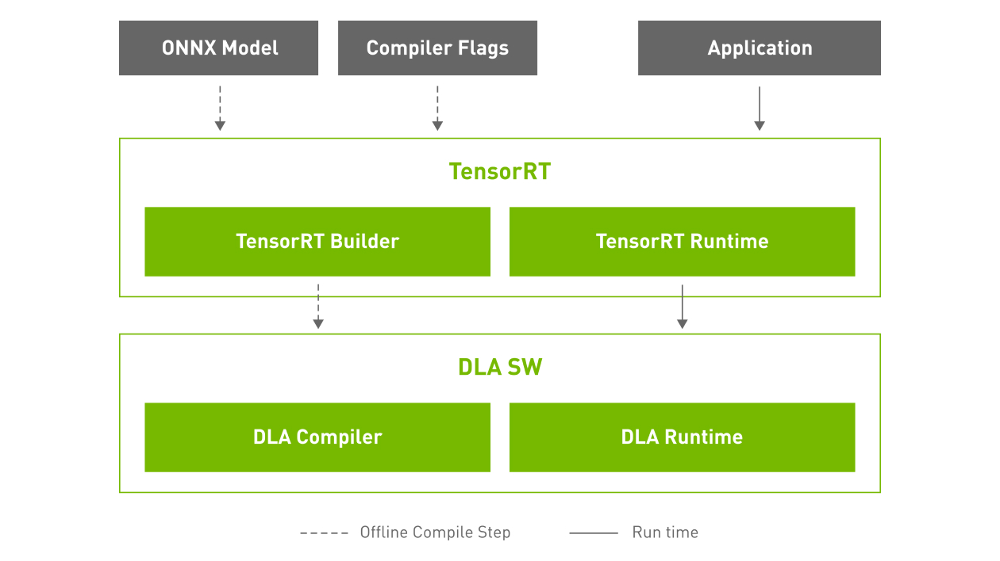

# CUDA basics  
CUDA (Compute Unified Device Architecture).  
GPGPU (General Purpose computing in GPU).  

# env setup  
1. Install cuda  
Download from https://developer.nvidia.com/cuda-downloads  
In ubuntu, use run file has less steps.  
```bash
wget https://developer.download.nvidia.com/compute/cuda/12.5.0/local_installers/cuda_12.5.0_555.42.02_linux.run  
sudo sh cuda_12.5.0_555.42.02_linux.run  
```
Or directly with apt install:  
```bash
apt install nvidia-cuda-toolkit  
```

# colab cuda usage  
We can also run cuda in colab, which is very convenient when we need just run some small cuda tests.  

# NVDLA
NVIDIA DLA hardware is a fixed-function accelerator engine targeted for deep learning operations.  
DLA software consists of the DLA compiler and the DLA runtime stack.  
TensorRT can run on DLA (including compiler and runtime).  

It supports TLM2 SystemC, QEMU and C++ implementations for runtime and Verilog for HW.  

# Reference link  
https://www.udemy.com/course/cuda-programming-masterclass/  
https://developer.nvidia.com/cuda-downloads  
https://devtalk.nvidia.com  

